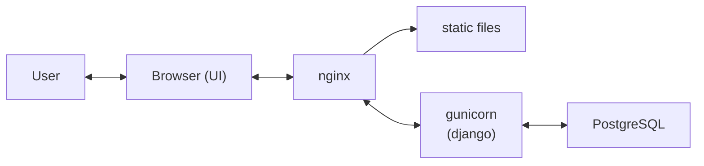

# Цифровой помощник мастера-технолога, специалиста по агротехнологии защищенного грунта

# 1. Цель проекта

Предоставить мастеру-технологу растениеводу, агроному-овощеводу, ответственному специалисту по гидротехническому обслуживанию теплиц и парников с круглогодичным выращиванием плодово-овощной продукции, удобный инструмент для диагностики состояния и оптимизации процессов выращивания сельскохозяйственных растений в теплицах и парниках.

**Краткое описание задач:**

-	Исследовать и проанализировать существующие данные об авариях и методах их устранения 
-	Составить базу знаний и предоставить возможность регулярного отслеживания состояние работы цеха
-	Выбрать LLM и интегрировать RAG для генерации нескольких вариантов действий, аргументирования положительных и отрицательных сторон предложенных вариантов и рекомендаций
-	Создать удобный и понятный пользователю frontend и backend приложения 

# 2. Область применения

В настоящее время технолог вынужден самостоятельно следить за показаниями датчиков, вручную определять отклонения от нормы и принимать решения на основе личного опыта. Планирование работ по уходу за растениями ведётся в блокнотах или «в голове», что приводит к пропуску важных операций, особенно при большом количестве посадок разных культур на разных стадиях роста.

Разрабатываемая система решает эти проблемы: автоматически анализирует данные с датчиков, выявляет аварийные ситуации и предлагает рекомендации по их устранению, а также формирует ежедневный список задач по уходу за растениями с учётом их стадий роста.

# 3. Архитектура программы

Веб-сервис «Agro-Mind» разработан на языке Python на основе фреймворка Django с использованием среды разработки PyCharm (от JetBrains) – стандартной IDE для написания кода на Python.  Архитектура имеет трёхуровневый вид (классика): пользовательский интерфейс (UI), серверную часть (Django), уровень веб-сервера/обратного прокси (Nginx) и уровень хранения данных (PostgreSQL). 

Такой подход обеспечивает простоту разработки, развёртывания и сопровождения, а также надёжность:


## 3.1.	Клиентский уровень – «Browser (UI)»
В качестве пользовательского интерфейса был выбран вариант веб-сервиса, поэтому любой пользователь может взаимодействовать с сервисом из обычного браузера (например, Google Chrome). Это значит, что пользователю не надо скачивать и осваивать новое ПО. Кроме того, такой UI обеспечивает кроссплатформенность (Windows/Linux/MacOS). Сам интерфейс реализуется стандартными веб‑технологиями (HTML/CSS/JavaScript), что позволяет удобно отображать данные, вводить параметры технологического процесса и получать рекомендации системы.
## 3.2.	Веб-сервер и обратный прокси – «nginx»

Nginx размещён на входе в систему и реализует следующие задачи:

-	**Единая точка входа:** все запросы через HTTPS (HTTP-запросы автоматически перенаправляются в HTTPS).
-	**Раздача статических файлов:** запросы к CSS, JS и изображениям проходят без участия Django для уменьшения нагрузки на приложение и уменьшения времени ответа.
-	**Проксирование динамических запросов:** перенаправление остального контента в Django через gunicorn для обеспечения большей безопасности и гибкой настройки.
-	**Повышение производительности:** Nginx эффективен при большом числе соединений и хорошо подходит для отдачи файлов и балансировки/проксирования.

## 3.3.	Сервер приложений – «gunicorn (django)»

Django отвечает за бизнес‑логику системы: обработку пользовательских запросов, выполнение расчётов, формирование рекомендаций, работу с формами и валидацией данных, а также взаимодействие с базой данных.

Gunicorn используется как WSGI‑сервер, потому что:
-	Django (в WSGI‑режиме) не предназначен для прямой работы “в интернет” через встроенный dev‑server.
-	Gunicorn обеспечивает параллельную обработку запросов (через workers), стабильную работу и более предсказуемую производительность.
-	Связка Nginx + Gunicorn + Django является стандартной и хорошо документированной.

## 3.4.	Статические файлы – «static files»

Статические файлы (CSS/JS/изображения) выделены отдельно, т.к.:

-	Не требуется выполнение Python‑кода.
-	Эффективность раздачи через Nginx (т.к. в отличие от однопоточного Django Nginx работает в многопоточном режиме).
-	Уменьшение задержки отклика и снижение нагрузку на Gunicorn/Django.

Статика собирается (например, через collectstatic) и хранится в специальном каталоге, доступном для пользователя nginx на сервере.

## 3.5.	База данных – «PostgreSQL»

Причины выбора именно PostgreSQL как СУБД системы:

-	Поддерживает надёжное хранение структурированных данных (пользователи, справочники, настройки, журналы измерений и т.п.).
-	Обеспечивает транзакционность и целостность данных.
-	Хорошо интегрируется с Django ORM и подходит для развития проекта (масштабирование, индексы, сложные запросы).
-	Является одной из самых популярных СУБД вследствие чего имеет много отличных образов в Docker Hub.

Вынос базы данных в отдельный сервис упрощает резервное копирование, обслуживание и масштабирование.

## 3.6.	Преимущества данной архитектуры

Выбранная схема даёт следующие преимущества:

-	**Разделение ответственности:** UI, статические файлы, бизнес логика и хранение данных разделены по компонентам.
-	**Производительность:** Nginx разгружает Django, отдавая статику и управляя соединениями.
-	**Надёжность и безопасность:** Django не выставляется напрямую наружу; входной слой контролируется Nginx.
-	**Масштабируемость:** при необходимости можно отдельно увеличивать ресурсы для web части (Gunicorn workers) и для базы данных.
-	**Повторяемость развёртывания:** компоненты удобно запускать через Docker/Compose как набор согласованных сервисов.

# 4. Назначение программы

## 4.1. Функциональное назначение

Программный продукт «Agro-Mind» предназначен для информационной и интеллектуальной поддержки мастера-технолога на предприятиях, использующих гидропонное выращивание растений. Система обеспечивает сбор, хранение, визуализацию и анализ данных мониторинга, включая выявление отклонений от заданных и исторических значений. «Agro-Mind» поддерживает планирование ухода за растениями по стадиям роста, формирование списка плановых операций и учёт выполненных работ. При аварийных ситуациях система использует базу знаний, локальную LLM и RAG-пайплайн для поиска информации и генерации обоснованных рекомендаций.

## 4.2. Эксплуатационное назначение

Система предназначена для круглосуточной работы через веб-браузер при наличии подключения к интернету. Доступ пользователей осуществляется по логину и паролю, при этом допустимое время плановых технических работ составляет не более 7,2 часов в месяц, а максимальное время восстановления после сбоя — не более 2 часов. Ожидаемая нагрузка составляет до 20 одновременных пользователей, до 1000 запросов в час и до 10 000 записей в базе знаний. В производственном процессе «Agro-Mind» получает данные от систем мониторинга, учёта, планирования и ручного ввода, а также предоставляет рекомендации, базу знаний и перечень плановых работ.


# 5. Запуск проекта  

## 5.1. Требования к серверу

### 5.1.1. Технические характеристики

**Минимальная конфигурация:**

- Операционная система: Ubuntu 22.04 LTS или Debian 12.
- Процессор: 4 ядра, архитектура x86_64, частота от 2.0 GHz.
- Оперативная память: 8 GB RAM.
- Видеокарта: NVIDIA от 8 GB VRAM – для локальной LLM.
- Накопитель: 64 GB SSD.
- Сеть: 100 Мбит/с, статический IP-адрес.

**Рекомендуемая конфигурация:**

- Операционная система: Ubuntu 24.04 LTS.
- Процессор: 8 ядер, частота от 3.0 GHz.
- Оперативная память: 16 GB RAM.
- Видеокарта: NVIDIA от 12 GB VRAM (RTX 5070, RTX 3090).
- Накопитель: 512 GB NVMe SSD.
- Сеть: 1 Гбит/с.

### 5.1.2. Необходимое ПО 
  
- Docker 24+  
- Nginx 1.28.2+  

## 5.2. Инструкция по развёртыванию сервиса

### 5.2.1. Создание файла с переменными окружения -- `.env`  
  
Обязательно используйте следующий шаблон:  
  
```dotenv  
GIDROPON_CONTAINER_NAME=...           # название контейнера с СУБД (если Вы не вносили изменения, то "gidropon-db")  
GIDROPON_DB_NAME=...                  # название БД (если Вы не вносили изменения, то "gidropon")  
GIDROPON_DB_USER=...                  # имя пользователя БД (если Вы не вносили изменения, то "postgres")  
GIDROPON_DB_PASSWORD=...              # пароль к БД (если Вы не вносили изменения, то "TAPs\8G:WIqn", но рекомендую заменить в docker-compose.yml)  
GIDROPON_DB_HOST=...                  # хост БД (укажите Ваш домен)  
GIDROPON_DB_PORT=...                  # порт контейнера с СУБД (если Вы не вносили изменения, то "5437")  
  
SSH_HOST=...                          # хост Вашего сервера (Ваш домен или IP)  
SSH_USER=...                          # пользователь сервера (введите Ваши данные)  
SSH_PASSWORD=...                      # пароль пользователя сервера (введите Ваши данные)  
SSH_BACKUP_DIR=...                    # путь к папке для сохранения бэкапов БД вне контейнера   
                                      # (<рекомендуется использовать путь вида "корневая папка с проектом на сервере>/backups)  
  
HOMEASSISTANT_EXISTS=...              # флаг наличия модуля HotBed Agro Smart Control  
HOMEASS_DB_PATH=...                   # путь к файлу с БД сохраняемых модулем показаний датчиков (считается, что используется СУБД SQLite)  
  
CELERY_BROKER_URL=...                 # путь доступа к RabbitMQ (брокер сообщений для асинхронных задач)  
 # имеет вид: "amqp://<RABBITMQ_DEFAULT_USER>:<RABBITMQ_DEFAULT_PASS>@localhost:<порт>//", # где 3 параметра настраиваются в docker-compose.yml (по умолчанию: rabbit, TR7cSO{ec[=B и 5672 соответственно)  
YOUR_DOMAIN=..                        # Ваш домен (автоматически подставится в config/settings.py)  
 # но если у Вас несколько доменов, то надо подставить в списки ALLOWED_HOSTS и                                      # CSRF_TRUSTED_ORIGINS в следующем виде: "https://<Ваш домен>"  
 # если планиурете использовать сервис только локально на Вашем ПК, то можете оставить пустым  
DEBUG=...                             # флаг для детального отображения ошибок (в использовании рекомендуется поставить "False")  
SECRET_KEY=...                        # секретный ключ для Django  
```  
  
### 5.2.2. Настройка Nginx на сервере  
  
Шаблон `nginx.conf`:  
  
```nginx  
server {  
	listen 80; 
	server_name <Ваш домен>; 
	return 301 https://$server_name$request_uri;
}  
  
server {  
	listen 443 ssl http2; 
	server_name <Ваш домен>;     

	# настройка SSL-сертификата:  
	ssl_certificate /etc/letsencrypt/live/<Ваш домен>/fullchain.pem; 
	ssl_certificate_key /etc/letsencrypt/live/<Ваш домен>/privkey.pem; 
	# это пример для сертификата, полученного при помощи протокола "Let's Encrypt"  
	 
	client_max_body_size 20M;  
	 
	location / { 
		proxy_pass http://127.0.0.1:5267;   # здесь "5267" - внешний порт, указанный в docker-compose.yml 
		proxy_set_header Host $host; 
		proxy_set_header X-Real-IP $remote_addr; 
		proxy_set_header X-Forwarded-For $proxy_add_x_forwarded_for; 
		proxy_set_header X-Forwarded-Proto https; 
	}
		
	access_log /var/log/nginx/access.log; 
	error_log /var/log/nginx/error.log;
}
```

После настройки `nginx.conf` рекомендуется выполнить в терминале (нужны права администратора):

```bash
sudo systemctl reload nginx         # перезагрузка Nginx
```

С тонкостями настройки Nginx рекомендую ознакомиться на сайте официальной документации: https://nginx.org/en/docs/  
  
## 5.3. Добавление домена(-ов)  
  
### 5.3.1. Если программа будет установлена на сервере  
  
#### 5.3.1.1. Если домен всего один  
  
Достаточно просто указать его в поле `YOUR_DOMAIN` файла `.env` и он автоматически подхватиться в настройках сервиса (`config/settings.py`).  
  
#### 5.3.1.2. Если доменов несколько  
  
*Прежде всего даже домены вида `example.com` и `www.example.com` считаются разными.*  
  
В файле `config/settings.py` надо указать Ваш домен(-ы). Далее пример (надо заполнить оба списка):
  
```python  
ALLOWED_HOSTS = [
	'localhost',
	'127.0.0.1',
	'example.com',             # точное совпадение домена 
	'www.example.com',         # второй домен 
	'256.256.256.256',         # IP-адрес сервера 
	'.example.com',            # example.com + все поддомены (api.example.com, blog.example.com)
	'myapp.internal',          # внутренние домены (без TLD тоже работает)]

CSRF_TRUSTED_ORIGINS = [  
    'http://localhost',  
    'http://127.0.0.1',  
    'https://example.com',
    'https://www.example.com',
    'https://256.256.256.256',
    'https://.example.com',
    'https://myapp.internal',
] 
```  
  
### 5.3.2. Если программа установлена на Вашем личном ПК  
  
Достаточно будет указать следующее:  
  
```python  
ALLOWED_HOSTS = [  
	'localhost', 
    '127.0.0.1',
]
CSRF_TRUSTED_ORIGINS =  [  
	'http://localhost',  
	'http://127.0.0.1',
]
```  
  
## 5.4. Основные команды
  
1. Клонирование репозитория:

```bash
git clone https://github.com/Dunckman/Gidropon                     # копирование кода проекта в локальную директорию
cd Gidropon                                                        # переход в директорию проекта
```

2. Сборка и запуск докера:

```bash
docker compose build                                               # сборка контейнеров
docker compose up -d                                               # запуск контейнеров
```

3. Настройка веб-сервиса:

```bash
docker compose exec web python manage.py migrate                   # создание таблиц в БД
docker compose exec web python manage.py bootstrap_base_data       # инициализация БД базовыми файлами: датчики (можно имзенить позднее) и периодические задачи
docker compose exec web python manage.py collectstatic --noinput   # сборка статических файлов в один каталог для nginx
docker compose exec web python manage.py createsuperuser           # создание админа (все данные вводить латиницей, потом можно изменить на странице пользователя).
```

4. Настройка Ollama:

```bash
docker compose exec ollama ollama pull qwen3:14b                   # загрузка модели для генерации ответа
docker compose exec ollama ollama pull nomic-embed-text:latest     # загрузка модели для генерации эмбеддингов
```